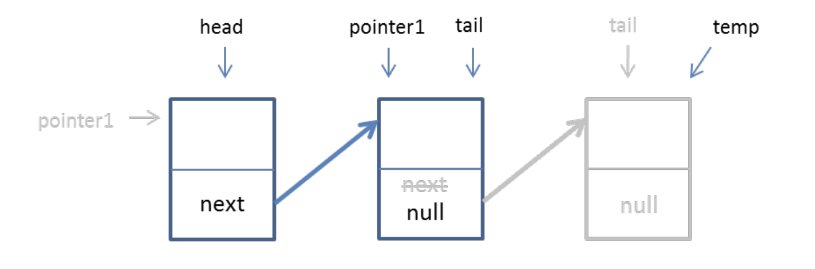

# Question 01

1.  Assume that a node class called `Node<E>` exist. Create two nodes called `node1` and `node2`. `node1` contains alphabet `‘a’` and `node2` contains alphabet `‘z’`. Also, create 2 references, `head` and `tail`. Let `head` points to `node1` and `tail` points to `node2`.
2.  Draw the nodes from (1).
3.  Write a statement / code for `node1` accessing the `node2`. Modify (2) to show this. 
4.  Create a new node, `firstNode`. Add this new node at the first location of all existing nodes. Draw these nodes. 
5.  If we have no information about the status of a linked-list, what are the conditions we need to consider to perform the operation in (4)?
6.  Write a list of operations / steps / pseudocode needed to add the `firstNode` to the first location.
7.  Write codes to assign the `firstNode` to the first location. 
8.  Repeat (4) – (6), for the following operations:

    * `addLast(E e)` – value of element, `c`
    * `add(int index, E e)` – value of element, `d`
    * `removeFirst()`
    * `removeLast()`
    * `remove(int index)` – remove at index 1

## Solution (Q1)

Part 1

```java
Node<Character> node1 = new Node<>('a');
Node<Character> node2 = new Node<>('z');

Node<Character> head = node1;
Node<Character> tail = node2;
```

Part 2

```
head:    tail:
node1 -> node2
```

Part 3

```java
node1.next = node2;
```

Part 4

```java
Node<Character> firstNode = new Node<>('f');
```
```
head:                 tail:
firstNode -> node1 -> node2
```

Part 5

* If the linked-list is empty, the new node becomes the head and the tail.
* If the linked-list is not empty, the new node becomes the head, and its next reference points to the old head.

Part 6

```
START
    CREATE firstNode
    IF tail == null
        head = tail = firstNode
        size = 1
    ELSE
        firstNode.next = head
        head = firstNode
        size++
    ENDIF
STOP
```

Part 7

```java
firstNode.next = head;
head = firstNode;
```

Part 8

* `addLast('c')`

    ```
    START
        IF tail == null
            head = tail = 'c'
            size = 1
        ELSE
            tail.next = 'c'
            tail = tail.next
            size++
        ENDIF
    STOP

    head:                          tail:
    firstNode -> node1 -> node2 -> ['c']
    ```
    
* `add(2, 'd')`

    ```
    START
        IF tail == null
            head = tail = 'd'
            size = 1
        ELSE IF 2 > size
            addLast('d')
        ELSE
            current = head
            ITERATE(1) current = current.next
            temp = current.next
            current.next = 'd'
            current.next.next = temp
            size++
        ENDIF
    STOP

    head:                                   tail:
    firstNode -> node1 -> ['d'] -> node2 -> ['c']
    ```

* `removeFirst()`

    ```
    START
        IF size == 0
            return null
        ELSE
            temp = head
            head = head.next
            size--
            return temp.element
        ENDIF
    STOP

    head:                      tail:
    node1 -> ['d'] -> node2 -> ['c']
    ```

* `removeLast()`
   
    ```
    START
        IF size == 0
            return null
        ELSE IF size == 1
            temp = tail
            head = tail = null
            size = 0
            return temp.element
        ELSE
            temp = tail
            current = head
            ITERATE(size - 2) current = current.next
            tail = current
            tail.next = null
            size--
            return temp.element
        ENDIF
    STOP

    head:             tail:
    node1 -> ['d'] -> node2
    ```

* `remove(1)`

    ```
    START
        IF size == 0
            return null
        ELSE IF size == 1
            removeLast()
        ELSE
            current = head
            previous = current
            temp = current.next
            previous.next = temp.next
            size--
            return temp
        ENDIF
    STOP

    head:    tail:
    node1 -> node2
    ```

# Question 02

Given is a method containing incorrect statements that checks if an element is in a list.

```java
public void operationX(E e) { 
    
    pointerB.next = pointerB;
    
    for(int i++; i > size; int i) {
        System.out.println(current.element);
            if(current.element = e) 
    } 
 
    Node<E> pointerB = head;
    return false;
}
```

1.  What is the name of the method for `operationX`?
2. Correct the statements by rewriting them in the correct order and syntax. Write the correct / right method name to replace `operationX`.

## Solution (Q2)

The name is `contains()`.

```java
public boolean contains(E e) {

    Node<E> current = head;

    while (current.element != null) {

        if (current.element == e) {
            System.out.println(current.element);
            return true;
        }

        current = current.next;
    }

    return false;
}
```

# Question 03

Given the following nodes. Answer the following:



1. Based on the above figure, what is the name of the method for above operation?
2. Write codes to represent the above figure. (Kindly use the variables stated in the figure)

## Solution (Q3)

The name is `removeLast()`.

```java
public E removeLast() {

    if (size == 0) return null;
    else if (size == 1) {
        size = 0;
        return tail;
    }
    else {
        
        Node<E> pointer1 = head;
        
        // Move to last 2nd node
        for (int i = 1; i < size - 1; i++) pointer1 = pointer1.next;

        // Remove last node
        Node<E> temp = tail;
        tail = pointer1;
        tail.next = null;
        
        size--;

        return temp.element;
    }
}
```