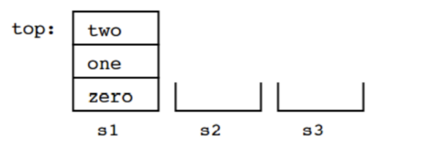

# Question 01

The stack method that returns an element from the stack without removing it is ____________.

## Solution (Q1)

- [ ] pop
- [ ] push
- [X] peek
- [ ] spy

# Question 02

We have three stacks, `s1`, `s2` and `s3`, that can contain data of type String. Here are their initial contents:



As you can see, initially `s2` and `s3` are empty. Here is a sequence of operations on the three stacks:

```java
s2.push(s1.pop());
s3.push(s1.pop());
s1.pop();
s1.push(s2.pop());
s2.push(s3.pop());
s2.push(s1.pop());
```

Draw the contents of the three stacks after the operations are complete.

## Solution (Q2)

```
        ┌─────┐
        │ two │
        ├─────┤
        │ one │
└─────┘ └─────┘ └─────┘
  s1      s2      s3
```

# Question 03

Over time, the elements 1, 2, and 3 are pushed onto a stack in that order. For each of the following, indicate (yes or no) whether the sequence could be created by popping operations. If yes, list the sequence of `push()` and `pop()` operations that produces the sequence.

1. 1-2-3 
2. 2-3-1 
3. 3-2-1 
4. 1-3-2

## Solution (Q3)

Part 1: Yes

```java
stack2.push(stack.pop());
stack2.push(stack.pop());
stack.pop();
stack2.pop();
stack2.pop();
```

Part 2: Yes

```java
stack_3.push(stack.pop());
stack.pop();
stack_3.pop();
stack.pop();
```

Part 3: Yes

```java
stack.pop();
stack.pop();
stack.pop();
```

Part 4: Yes

```java
stack_3.push(stack.pop());
stack_2.push(stack.pop());
stack.pop();
stack_3.pop();
stack_2.pop();
```

# Question 04

Convert the following infix expressions to postfix:

1. a + b * c
2. a * b – c/d
3. a + (b*c + d)/e

## Solution (Q4)

Part 1:

```java
a b c * +
```

Part 2:

```java
a b * c d / -
```

Part 3:

```java
a b c * d + e / +
```

# Question 05

Write the following expressions in infix form:

1. a b + c *
2. a b c + *

## Solution (Q5)

Part 1:

```java
(a + b) * c
```

Part 2:

```java
a * (b + c)
```

# Question 06

Which of the following is an application of stack?

## Solution (Q6)

- [ ] finding factorial
- [ ] tower of Hanoi
- [ ] infix to postfix
- [X] all of the above