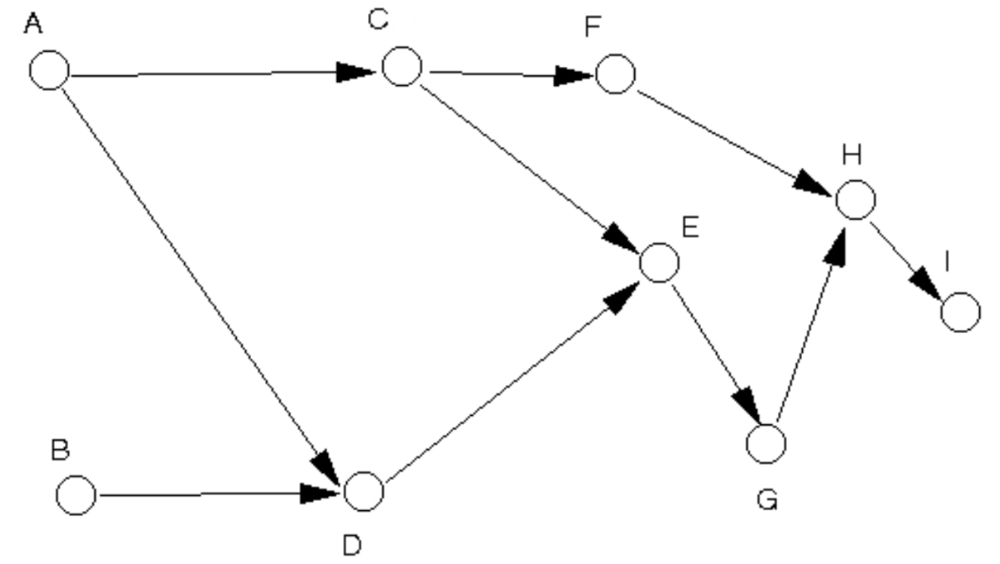

# Question 01

Write an adjacency matrix and an adjacency list for the following graph.



## Solution (Q1)

Adjacency Matrix:

```
     A  B  C  D  E  F  G  H  I  
  ┌─                           ─┐
A │  0  0  1  1  0  0  0  0  0  │
B │  0  0  0  1  0  0  0  0  0  │
C │  1  0  0  0  1  1  0  0  0  │
D │  1  1  0  0  1  0  0  0  0  │
E │  0  0  1  1  0  0  1  0  0  │
F │  0  0  1  0  0  0  0  1  0  │
G │  0  0  0  0  1  0  0  1  0  │
H │  0  0  0  0  0  1  1  0  1  │
I │  0  0  0  0  0  0  0  1  0  │
  └─                           ─┘
```

Adjacency List

```
    ┌───┬───┐   ┌───┬───┐   ┌───┬───┐
[0] │ A │ ○─┼──>│ C │ ○─┼──>│ D │ / │
    └───┴───┘   └───┴───┘   └───┴───┘
    ┌───┬───┐   ┌───┬───┐
[1] │ B │ ○─┼──>│ D │ / │
    └───┴───┘   └───┴───┘
    ┌───┬───┐   ┌───┬───┐   ┌───┬───┐
[2] │ C │ ○─┼──>│ E │ ○─┼──>│ F │ / │
    └───┴───┘   └───┴───┘   └───┴───┘
    ┌───┬───┐   ┌───┬───┐
[3] │ D │ ○─┼──>│ E │ / │
    └───┴───┘   └───┴───┘
    ┌───┬───┐   ┌───┬───┐
[4] │ E │ ○─┼──>│ G │ / │
    └───┴───┘   └───┴───┘
    ┌───┬───┐   ┌───┬───┐
[5] │ F │ ○─┼──>│ H │ / │
    └───┴───┘   └───┴───┘
    ┌───┬───┐   ┌───┬───┐
[6] │ G │ ○─┼──>│ H │ / │
    └───┴───┘   └───┴───┘
    ┌───┬───┐   ┌───┬───┐
[7] │ H │ ○─┼──>│ I │ / │
    └───┴───┘   └───┴───┘
    ┌───┬───┐
[8] │ I │ / │
    └───┴───┘
```

# Question 02

Represent the graph in question 1 using a 2 dimensional array. You use the adjacency matrix or the adjacency list for this purpose?

## Solution (Q2)

Adjacency Matrix.

```java
int[][] adjacencyMatrix = {
    { 0, 0, 1, 1, 0, 0, 0, 0, 0 },
    { 0, 0, 0, 1, 0, 0, 0, 0, 0 },
    { 1, 0, 0, 0, 1, 1, 0, 0, 0 },
    { 1, 1, 0, 0, 1, 0, 0, 0, 0 },
    { 0, 0, 1, 1, 0, 0, 1, 0, 0 },
    { 0, 0, 1, 0, 0, 0, 0, 1, 0 },
    { 0, 0, 0, 0, 1, 0, 0, 1, 0 },
    { 0, 0, 0, 0, 0, 1, 1, 0, 1 },
    { 0, 0, 0, 0, 0, 0, 0, 1, 0 }
};
```

# Question 03

Write code to create the graph using linked-list representation. You use the adjacency matrix or the adjacency list for this purpose?

## Solution (Q3)

Adjacency List.

```java
LinkedList<Vertex> listA = new LinkedList<>(); listA.addLast(A); listA.addLast(C); listA.addLast(D);
LinkedList<Vertex> listB = new LinkedList<>(); listB.addLast(B); listB.addLast(D);
LinkedList<Vertex> listC = new LinkedList<>(); listC.addLast(C); listC.addLast(E); listC.addLast(F);
LinkedList<Vertex> listD = new LinkedList<>(); listD.addLast(D); listD.addLast(E);
LinkedList<Vertex> listE = new LinkedList<>(); listE.addLast(E); listE.addLast(G);
LinkedList<Vertex> listF = new LinkedList<>(); listF.addLast(F); listF.addLast(H);
LinkedList<Vertex> listG = new LinkedList<>(); listG.addLast(G); listG.addLast(H);
LinkedList<Vertex> listH = new LinkedList<>(); listH.addLast(H); listH.addLast(I);
LinkedList<Vertex> listI = new LinkedList<>(); listI.addLast(I);
```