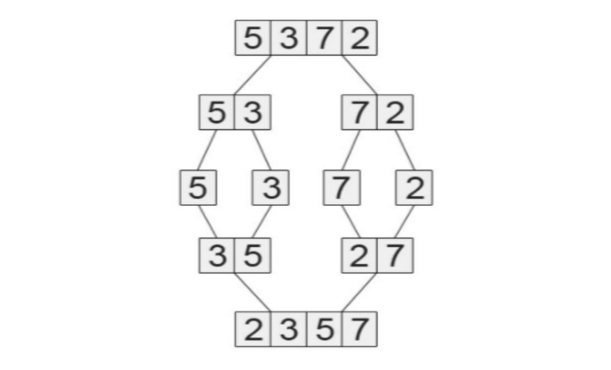
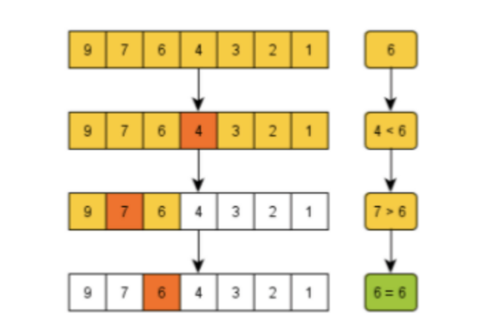
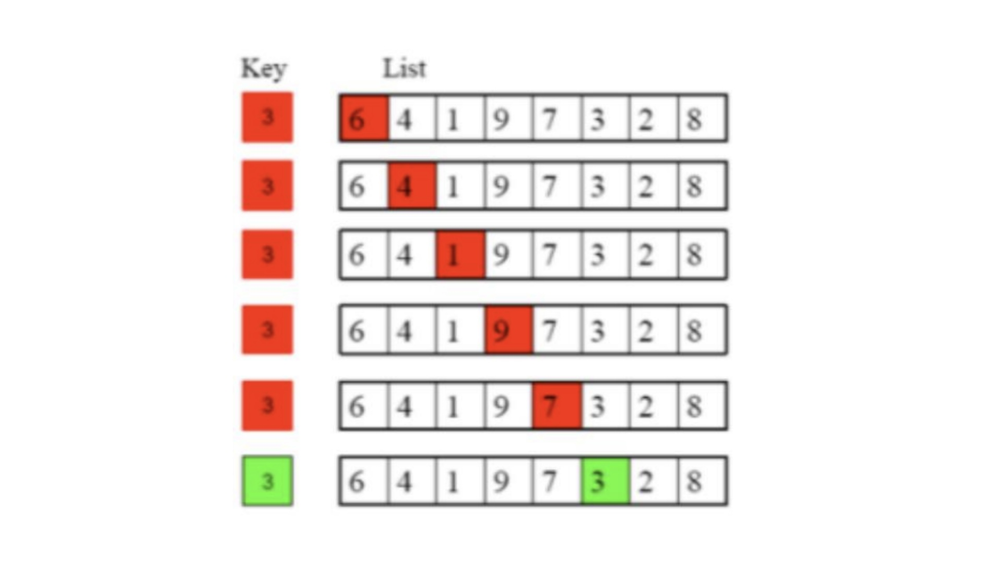

# Question 01

Compare between linear search and binary search algorithms by searching for the numbers `45` and `54` in the following list: `3 8 12 34 54 85 61 110`

## Solution (Q1)

Linear search searches an element in a given list of length `N` linearly from the first element to the last element with `O(N)` time complexity. 

Binary search searches an element in a given **sorted** list of length `N` by comparing it with the value of the pivot element with `O(log(N))` time complexity. Since it needs a sorted list (conventionally sorted in ascending order), the given list will need to be sorted first before performing the binary search. Sorted list: `3 8 12 34 54 61 85 110`

While searching for number `45`:

* Linear search algorithm will iterate from index 0 to the last index and return `-1` because up until the last index this element is not found. Number of iterations is 8.
* Binary search algorithm will take the middle element `54` as pivot point and found that it is larger than `45`, so the `high` will be set to element `34` and the `mid` will be set to `8`, then because the `mid` is less than `45` so the `low` will be set to `12` and the `mid` will also be `12`, then the `high` will become smaller than `low` and the search returns `-1` as element is not found. Number of iterations is 3.

While searching for number `54`:

* Linear search algorithm will iterate from index 0 up until index 4 where `54` is found and the index will be returned. Number of iterations is 5.
* Binary search algorithm for this case will take the middle element `54` as a pivot point and immediately return the middle index because this element is exactly the element to be searched. Number of iteration is 1.

# Question 02

Describe the technique for each sort algorithm below. Given the following list: `90 8 7 56 125 237 9 1 653`

Show a trace of execution for:

* Selection sort
* Insertion sort
* Bubble sort
* Merge sort

## Solution (Q2)

Selection Sort:

```
    ┌─────┬─────┬─────┬─────┬─────┬─────┬─────┬─────┬─────┐
idx │  90 │   8 │   7 │  56 │ 125 │ 237 │   9 │   1 │ 653 │
    └─────┴─────┴─────┴─────┴─────┴─────┴─────┴─────┴─────┘
    ┌─────┬─────┬─────┬─────┬─────┬─────┬─────┬─────┬─────┐
[0] │   1 │   8 │   7 │  56 │ 125 │ 237 │   9 │  90 │ 653 │
    └─────┴─────┴─────┴─────┴─────┴─────┴─────┴─────┴─────┘
    ┌─────┬─────┬─────┬─────┬─────┬─────┬─────┬─────┬─────┐
[1] │   1 │   7 │   8 │  56 │ 125 │ 237 │   9 │  90 │ 653 │
    └─────┴─────┴─────┴─────┴─────┴─────┴─────┴─────┴─────┘
    ┌─────┬─────┬─────┬─────┬─────┬─────┬─────┬─────┬─────┐
[2] │   1 │   7 │   8 │  56 │ 125 │ 237 │   9 │  90 │ 653 │
    └─────┴─────┴─────┴─────┴─────┴─────┴─────┴─────┴─────┘
    ┌─────┬─────┬─────┬─────┬─────┬─────┬─────┬─────┬─────┐
[3] │   1 │   7 │   8 │   9 │ 125 │ 237 │  56 │  90 │ 653 │
    └─────┴─────┴─────┴─────┴─────┴─────┴─────┴─────┴─────┘
    ┌─────┬─────┬─────┬─────┬─────┬─────┬─────┬─────┬─────┐
[4] │   1 │   7 │   8 │   9 │  56 │ 237 │ 125 │  90 │ 653 │
    └─────┴─────┴─────┴─────┴─────┴─────┴─────┴─────┴─────┘
    ┌─────┬─────┬─────┬─────┬─────┬─────┬─────┬─────┬─────┐
[5] │   1 │   7 │   8 │   9 │  56 │  90 │ 125 │ 237 │ 653 │
    └─────┴─────┴─────┴─────┴─────┴─────┴─────┴─────┴─────┘
    ┌─────┬─────┬─────┬─────┬─────┬─────┬─────┬─────┬─────┐
[6] │   1 │   7 │   8 │   9 │  56 │  90 │ 125 │ 237 │ 653 │
    └─────┴─────┴─────┴─────┴─────┴─────┴─────┴─────┴─────┘
    ┌─────┬─────┬─────┬─────┬─────┬─────┬─────┬─────┬─────┐
[7] │   1 │   7 │   8 │   9 │  56 │  90 │ 125 │ 237 │ 653 │
    └─────┴─────┴─────┴─────┴─────┴─────┴─────┴─────┴─────┘
    ┌─────┬─────┬─────┬─────┬─────┬─────┬─────┬─────┬─────┐
[8] │   1 │   7 │   8 │   9 │  56 │  90 │ 125 │ 237 │ 653 │
    └─────┴─────┴─────┴─────┴─────┴─────┴─────┴─────┴─────┘
```

Insertion Sort:

```
    ┌─────┬─────┬─────┬─────┬─────┬─────┬─────┬─────┬─────┐
itr │  90 │   8 │   7 │  56 │ 125 │ 237 │   9 │   1 │ 653 │
    └─────┴─────┴─────┴─────┴─────┴─────┴─────┴─────┴─────┘
    ┌─────┬─────┬─────┬─────┬─────┬─────┬─────┬─────┬─────┐
[1] │   8 │  90 │   7 │  56 │ 125 │ 237 │   9 │  90 │ 653 │
    └─────┴─────┴─────┴─────┴─────┴─────┴─────┴─────┴─────┘
    ┌─────┬─────┬─────┬─────┬─────┬─────┬─────┬─────┬─────┐
[2] │   7 │   8 │  90 │  56 │ 125 │ 237 │   9 │  90 │ 653 │
    └─────┴─────┴─────┴─────┴─────┴─────┴─────┴─────┴─────┘
    ┌─────┬─────┬─────┬─────┬─────┬─────┬─────┬─────┬─────┐
[3] │   7 │   8 │  56 │  90 │ 125 │ 237 │   9 │  90 │ 653 │
    └─────┴─────┴─────┴─────┴─────┴─────┴─────┴─────┴─────┘
    ┌─────┬─────┬─────┬─────┬─────┬─────┬─────┬─────┬─────┐
[4] │   7 │   8 │  56 │  90 │ 125 │ 237 │   9 │  90 │ 653 │
    └─────┴─────┴─────┴─────┴─────┴─────┴─────┴─────┴─────┘
    ┌─────┬─────┬─────┬─────┬─────┬─────┬─────┬─────┬─────┐
[5] │   7 │   8 │  56 │  90 │ 125 │ 237 │   9 │  90 │ 653 │
    └─────┴─────┴─────┴─────┴─────┴─────┴─────┴─────┴─────┘
    ┌─────┬─────┬─────┬─────┬─────┬─────┬─────┬─────┬─────┐
[6] │   7 │   8 │   9 │  56 │  90 │ 125 │ 237 │  90 │ 653 │
    └─────┴─────┴─────┴─────┴─────┴─────┴─────┴─────┴─────┘
    ┌─────┬─────┬─────┬─────┬─────┬─────┬─────┬─────┬─────┐
[7] │   7 │   8 │   9 │  56 │  90 │  90 │ 125 │ 237 │ 653 │
    └─────┴─────┴─────┴─────┴─────┴─────┴─────┴─────┴─────┘
    ┌─────┬─────┬─────┬─────┬─────┬─────┬─────┬─────┬─────┐
[8] │   7 │   8 │   9 │  56 │  90 │  90 │ 125 │ 237 │ 653 │
    └─────┴─────┴─────┴─────┴─────┴─────┴─────┴─────┴─────┘
```

Bubble Sort:

```
    ┌─────┬─────┬─────┬─────┬─────┬─────┬─────┬─────┬─────┐
idx │  90 │   8 │   7 │  56 │ 125 │ 237 │   9 │   1 │ 653 │
    └─────┴─────┴─────┴─────┴─────┴─────┴─────┴─────┴─────┘
    ┌─────┬─────┬─────┬─────┬─────┬─────┬─────┬─────┬─────┐
[8] │   8 │   7 │  56 │  90 │ 125 │   9 │   1 │ 237 │ 653 │
    └─────┴─────┴─────┴─────┴─────┴─────┴─────┴─────┴─────┘
    ┌─────┬─────┬─────┬─────┬─────┬─────┬─────┬─────┬─────┐
[7] │   7 │   8 │  56 │  90 │   9 │   1 │ 125 │ 237 │ 653 │
    └─────┴─────┴─────┴─────┴─────┴─────┴─────┴─────┴─────┘
    ┌─────┬─────┬─────┬─────┬─────┬─────┬─────┬─────┬─────┐
[6] │   7 │   8 │  56 │   9 │   1 │  90 │ 125 │ 237 │ 653 │
    └─────┴─────┴─────┴─────┴─────┴─────┴─────┴─────┴─────┘
    ┌─────┬─────┬─────┬─────┬─────┬─────┬─────┬─────┬─────┐
[5] │   7 │   8 │   9 │   1 │  56 │  90 │ 125 │ 237 │ 653 │
    └─────┴─────┴─────┴─────┴─────┴─────┴─────┴─────┴─────┘
    ┌─────┬─────┬─────┬─────┬─────┬─────┬─────┬─────┬─────┐
[4] │   7 │   8 │   1 │   9 │  56 │  90 │ 125 │ 237 │ 653 │
    └─────┴─────┴─────┴─────┴─────┴─────┴─────┴─────┴─────┘
    ┌─────┬─────┬─────┬─────┬─────┬─────┬─────┬─────┬─────┐
[3] │   7 │   1 │   8 │   9 │  56 │  90 │ 125 │ 237 │ 653 │
    └─────┴─────┴─────┴─────┴─────┴─────┴─────┴─────┴─────┘
    ┌─────┬─────┬─────┬─────┬─────┬─────┬─────┬─────┬─────┐
[2] │   1 │   7 │   8 │   9 │  56 │  90 │ 125 │ 237 │ 653 │
    └─────┴─────┴─────┴─────┴─────┴─────┴─────┴─────┴─────┘
```

Merge Sort:

```
    ┌─────┬─────┬─────┬─────┬─────┬─────┬─────┬─────┬─────┐
rec │  90 │   8 │   7 │  56 │ 125 │ 237 │   9 │   1 │ 653 │
    └─────┴─────┴─────┴─────┴─────┴─────┴─────┴─────┴─────┘
    ┌─────┬─────┬─────┬─────┐           ┌─────┬─────┬─────┬─────┬─────┐
[1] │  90 │   8 │   7 │  56 │           │ 125 │ 237 │   9 │   1 │ 653 │
    └─────┴─────┴─────┴─────┘           └─────┴─────┴─────┴─────┴─────┘
    ┌─────┬─────┐     ┌─────┬─────┐     ┌─────┬─────┬─────┬─────┬─────┐
[2] │  90 │   8 │     │   7 │  56 │     │ 125 │ 237 │   9 │   1 │ 653 │
    └─────┴─────┘     └─────┴─────┘     └─────┴─────┴─────┴─────┴─────┘
    ┌─────┬─────┬─────┬─────┐           ┌─────┬─────┐     ┌─────┬─────┬─────┐
[3] │   7 │   8 │  56 │  90 │           │ 125 │ 237 │     │   9 │   1 │ 653 │
    └─────┴─────┴─────┴─────┘           └─────┴─────┘     └─────┴─────┴─────┘
    ┌─────┬─────┬─────┬─────┐           ┌─────┬─────┐     ┌─────┬─────┬─────┐
[4] │   7 │   8 │  56 │  90 │           │ 125 │ 237 │     │   1 │   9 │ 653 │
    └─────┴─────┴─────┴─────┘           └─────┴─────┘     └─────┴─────┴─────┘
    ┌─────┬─────┬─────┬─────┐           ┌─────┬─────┬─────┬─────┬─────┐
[5] │   7 │   8 │  56 │  90 │           │   1 │   9 │ 125 │ 237 │ 653 │
    └─────┴─────┴─────┴─────┘           └─────┴─────┴─────┴─────┴─────┘
    ┌─────┬─────┬─────┬─────┬─────┬─────┬─────┬─────┬─────┐
[6] │   1 │   7 │   8 │   9 │  56 │  90 │ 125 │ 237 │ 653 │
    └─────┴─────┴─────┴─────┴─────┴─────┴─────┴─────┴─────┘
```

# Question 03

Which type of sort algorithm is this?



## Solution (Q3)

Merge Sort

# Question 04

Which type of search algorithm is this?



## Solution (Q4)

Binary Search

# Question 05

Which type of search algorithm is this?



## Solution (Q5)

Linear Search