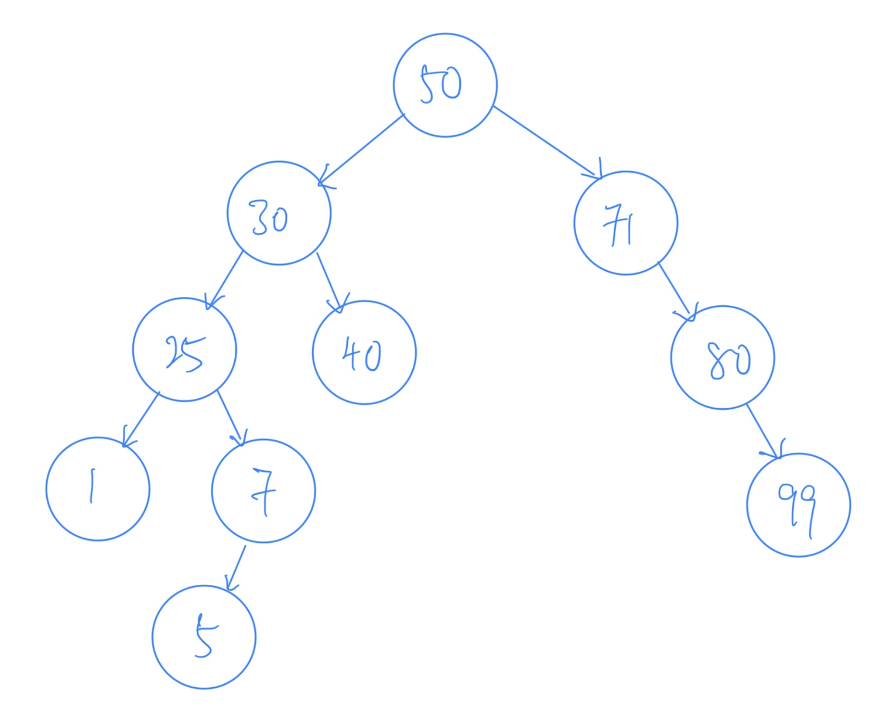
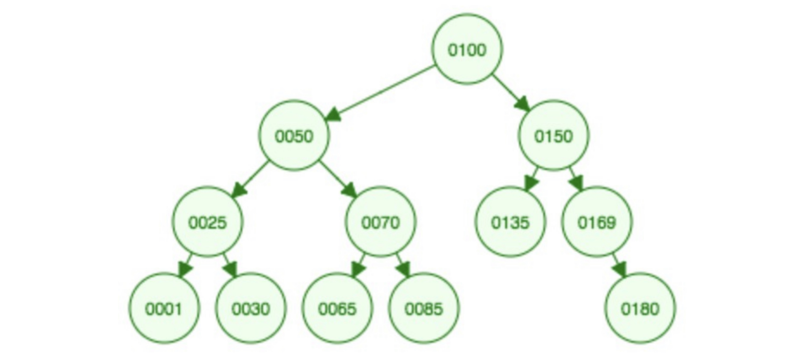
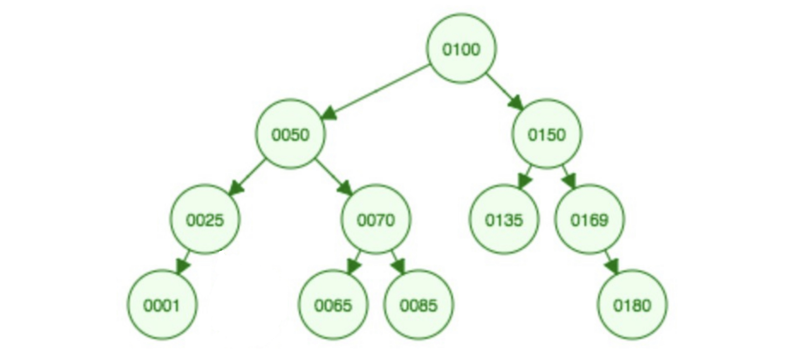
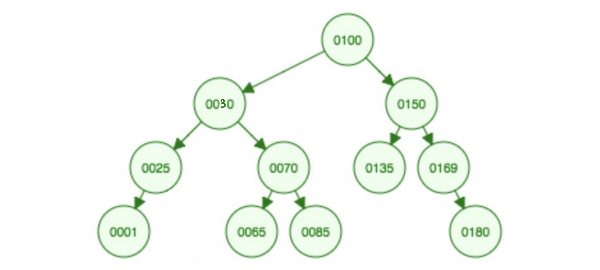

# Question 01

What is a binary search tree (BST)?

## Solution (Q1)

A binary search tree (BST) is a way to organize a bunch of data where each item has a value, and the tree helps you quickly find a specific item by comparing its value to the values of the items in the tree. 

* BST is called "binary" because each item can have at most two child items. 
* BST is organized so that each item's value is greater than the value of its left child, and less than the value of its right child. 
    * This makes it easy to narrow down your search for a specific item as you move through the tree.

# Question 02

Build a BST based on the input 50, 30, 25, 71, 80, 99, 40, 1, 7, 5. Draw the final tree.

## Solution (Q2)

# Question 03

What is the height of the tree built in Question 2?

## Solution (Q3)

5

# Question 04

Given the following BST, list the items in the order of:

* Pre-Order traversal
* In-Order traversal
* Post-order traversal

## Solution (Q4)

Pre-Order Travesal:

`0100`, `0050`, `0025`, `0001`, `0030`, `0070`, `0065`, `0085`, `0150`, `0135`, `0169`, `0180`

In-Order Travesal:

`0001`, `0025`, `0030`, `0050`, `0065`, `0070`, `0085`, `0100`, `0135`, `0150`, `0169`, `0180`

Post-Order Travesal:

`0001`, `0030`, `0025`, `0065`, `0085`, `0070`, `0050`, `0135`, `0180`, `0169`, `0150`, `0100`

# Question 05

Using the same BST in Question 4, delete the element `0030`. Draw the resulting tree. 

## Solution (Q5)

# Question 06

Again, using the same BST in Question 4 (i.e., ignoring the deletion of `0030` in Question 5), delete the element `0050`. Draw the resulting tree.

## Solution (Q6)

